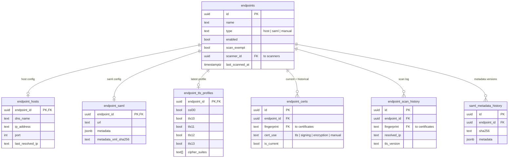
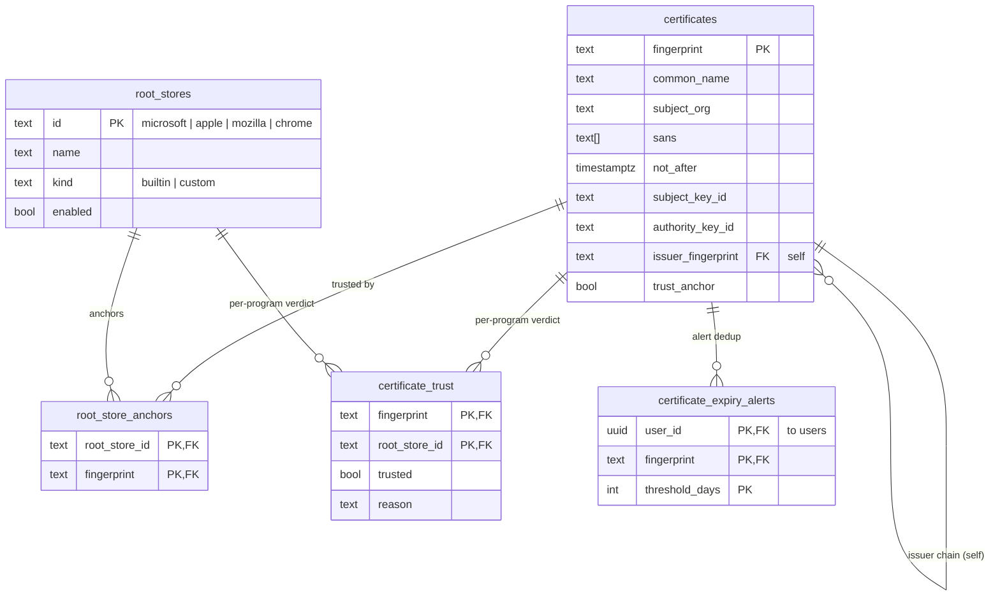
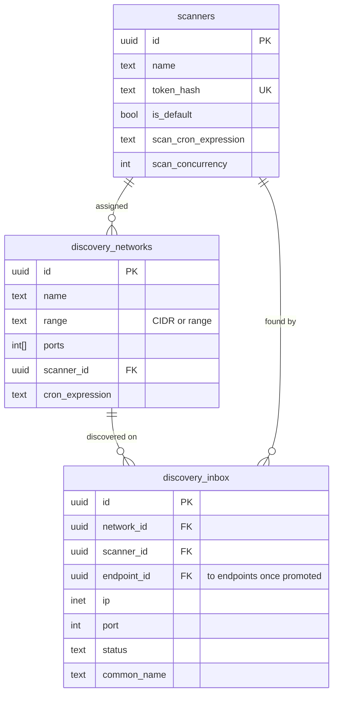
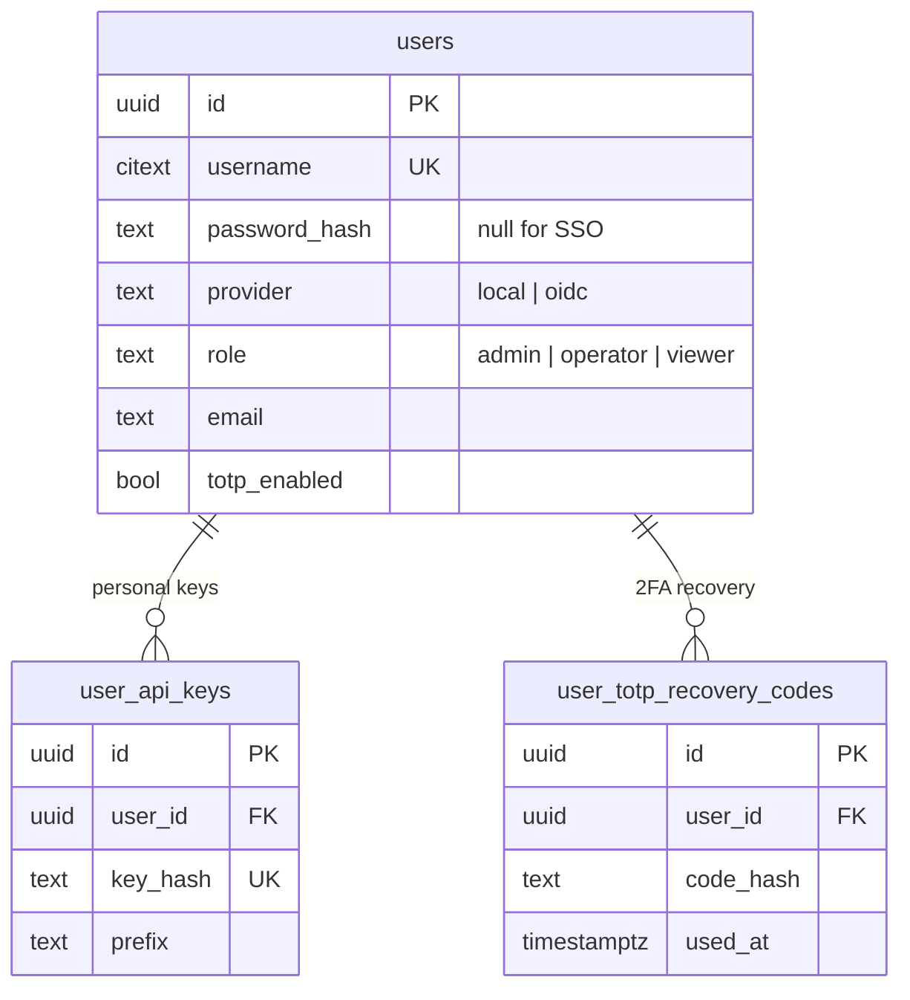
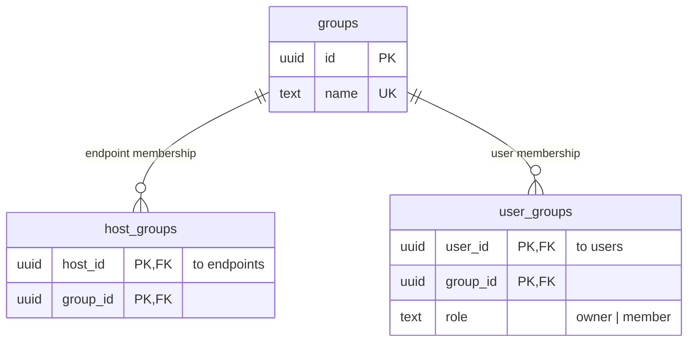
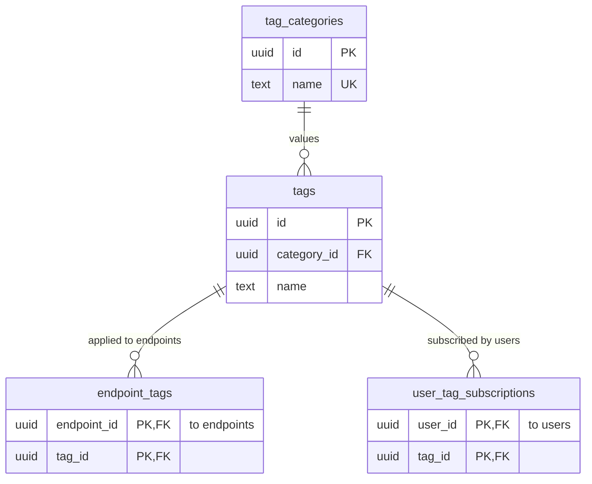
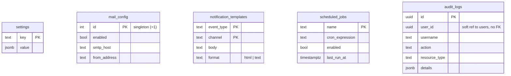

<p align="center">
  <picture>
    
  </picture>
</p>

<h1>TLSentinel — Server</h1>

<p>
  Self-hosted TLS & PKI hub for infrastructure admins — certificate
  monitoring with expiry alerts, CCADB-backed root program trust
  matrix, and a PKI toolbox (decoder, CSR, chain validator, diff).
</p>

<h3>
  <a href="#getting-started">Getting Started</a>
  <span> · </span>
  <a href="#environment-variables">Configuration</a>
  <span> · </span>
  <a href="#database-schema">Schema</a>
  <span> · </span>
  <a href="https://github.com/tlsentinel/tlsentinel-scanner">Scanner Agent</a>
</h3>

<br/>

## Features

- **Endpoint tracking** — three endpoint types cover most fleets:
  - **Host** — standard `host:port` TLS endpoint
  - **SAML** — IdP/SP metadata endpoint with parsed metadata and document
    history
  - **Manual** — a certificate uploaded directly (no live scanning)
- **TLS profile scanning with SSL Labs-style grading.** Scanners enumerate
  supported TLS versions (including SSL 3.0) and cipher suites on every
  cycle. The server computes a letter grade (A+ through F) and component
  sub-scores for protocol support, key exchange, and cipher strength,
  following the SSL Labs SSL Server Rating Guide as closely as the probe's
  inputs allow.
- **CCADB-backed trust anchor tracking.** A daily refresh pulls the trust
  matrix and PEM bundles for the four major root programs (Apple, Chrome,
  Microsoft, Mozilla). Ingested certificates are tagged with per-program
  membership and a canonical `trust_anchor` flag. The chain-of-trust
  visualization terminates at the first Subject+SKI-equivalent anchor,
  matching how platform verifiers behave.
- **Per-program root store browser.** Tab between programs, search
  anchors by common name or organization, click through to the
  certificate detail page.
- **PKI toolbox.** In-browser utilities that never transmit data off
  your machine: certificate and CSR decoders, CSR generator (keys stay
  local), chain builder/validator, certificate diff, and PEM/DER
  converter.
- **SAML metadata history.** Each distinct metadata document observed per
  SAML endpoint is persisted with a SHA-256 digest so you can diff
  historical signing certificates and SP/IdP configuration changes.
- **Expiry email alerts.** Fires at 30, 14, 7, and 1-day thresholds with
  per-user opt-in, editable templates, and a dedupe table
  (`cert_expiry_alerts`) to prevent duplicate sends across restarts.
- **Per-user ICS calendar feed.** A tokenized URL
  (`/calendar/u/{token}`) exports upcoming expirations to any
  RFC 5545-compliant calendar client.
- **Network discovery.** Scheduled CIDR or range scans enumerate
  listening TLS services across ports, queueing discovered hosts into an
  inbox for review before they become monitored endpoints.
- **Tags and categories.** Structured `Category:Tag` labeling for
  endpoints, with color-coded categories.
- **Distributed scanners.** Any number of scanner agents register with
  the server using hashed tokens (`stx_s_…` prefix, SHA-256 backed).
  Scan interval and concurrency are server-managed and picked up on the
  next poll tick without restarting the agent.
- **Auth.** Local users with bcrypt-hashed passwords, or OIDC
  single sign-on against your provider of choice. Admin / operator /
  viewer roles with permission-based RBAC. Personal API keys with scoped
  permissions and per-key revocation.
- **Audit log.** Every state-changing action is recorded with actor,
  action, resource, IP, and user-agent. `X-Forwarded-For` is honored
  only for peers inside `TLSENTINEL_TRUSTED_PROXY_CIDRS` to prevent
  source-IP spoofing.
- **Maintenance scheduler.** In-process cron runs the nightly jobs
  (expiry alerts, purge scan history, purge audit logs, purge stale
  expiry-alert records, refresh root stores). Each schedule and
  retention window is editable from Settings → Maintenance, with
  manual Run-Now for troubleshooting.
- **Universal search.** `GET /search?q=` returns top matches across
  endpoints, certificates, and scanners. Powers the header
  command-search dropdown.
- **In-app documentation.** Markdown docs served straight from the web
  bundle so the same content can be shared with the read-the-docs site.

## Screenshots

<p align="center">
  <picture>
    
  </picture>
  <picture>
    
  </picture>
</p>

## Getting Started

The recommended deployment is Docker. Both the server and scanner
publish images; `docker-compose.yml` in this repo orchestrates the
full stack against a bundled Postgres.

```sh
git clone https://github.com/tlsentinel/tlsentinel-server.git
cd tlsentinel-server
cp .env.example .env
# edit .env — at minimum set DB credentials, JWT secret, and encryption key
docker compose up -d
```

Migrations run automatically on startup. The first boot bootstraps an
admin user from `TLSENTINEL_ADMIN_USERNAME` / `TLSENTINEL_ADMIN_PASSWORD`
if those are set; subsequent boots ignore them.

Generate the two required secret values with:

```sh
openssl rand -base64 32   # TLSENTINEL_JWT_SECRET
openssl rand -base64 32   # TLSENTINEL_ENCRYPTION_KEY
```

## Environment Variables

### HTTP

| Variable            | Default   | Description |
|---------------------|-----------|-------------|
| `TLSENTINEL_HOST`   | `0.0.0.0` | Bind address. |
| `TLSENTINEL_PORT`   | `8080`    | Bind port. |

### Database

| Variable                   | Default       | Description |
|----------------------------|---------------|-------------|
| `TLSENTINEL_DB_HOST`       | `localhost`   | Postgres host. |
| `TLSENTINEL_DB_PORT`       | `5432`        | Postgres port. |
| `TLSENTINEL_DB_NAME`       | `tlsentinel`  | Database name. |
| `TLSENTINEL_DB_USERNAME`   | *(required)*  | Username. |
| `TLSENTINEL_DB_PASSWORD`   | *(required)*  | Password. |
| `TLSENTINEL_DB_SSLMODE`    | `require`     | `disable`, `require`, `verify-ca`, or `verify-full`. |

### Secrets

| Variable                    | Description |
|-----------------------------|-------------|
| `TLSENTINEL_JWT_SECRET`     | **Required.** JWT signing secret, base64-encoded, must decode to ≥32 bytes. Generate with `openssl rand -base64 32`. Rotating this value invalidates every outstanding session. |
| `TLSENTINEL_ENCRYPTION_KEY` | **Required.** AES-256 key for encrypting SMTP passwords at rest, base64-encoded, must decode to exactly 32 bytes. Generate with `openssl rand -base64 32`. |

### Bootstrap admin

| Variable                     | Description |
|------------------------------|-------------|
| `TLSENTINEL_ADMIN_USERNAME`  | Optional. Creates an admin user on first startup if not already present. |
| `TLSENTINEL_ADMIN_PASSWORD`  | Optional. Initial password for the bootstrap admin. |

### Break-glass recovery

Last-resort env-var path for recovering an admin who lost both their
TOTP device and recovery codes (or forgot their password). Distinct
from the bootstrap admin vars above — this runs against an *existing*
admin and applies a destructive reset.

`TLSENTINEL_BREAKGLASS` is the master toggle. Reset flags without it
set are logged and ignored, so an accidentally-baked-in compose value
won't error every restart. Bootstrap refuses to operate on non-admin
accounts or non-local (OIDC) users.

| Variable                                    | Description |
|---------------------------------------------|-------------|
| `TLSENTINEL_BREAKGLASS`                     | Master toggle. `true` to apply the reset on next boot. |
| `TLSENTINEL_BREAKGLASS_USER`                | Username of the admin to recover (the *current* username, not the seed value above). |
| `TLSENTINEL_BREAKGLASS_RESET_TOTP`          | `true` to clear TOTP secret + recovery codes (lost-phone case). |
| `TLSENTINEL_BREAKGLASS_RESET_PASSWORD`      | `true` to reset the password to `TLSENTINEL_BREAKGLASS_PASSWORD`. |
| `TLSENTINEL_BREAKGLASS_PASSWORD`            | Required iff `RESET_PASSWORD=true`. The new password. |

**Operator runbook:**

1. Set the env vars above for the recovery you need (TOTP, password,
   or both).
2. Restart the container. Watch for `breakglass executed` in the logs
   and an `auth.bootstrap.breakglass` row in the audit log.
3. Remove all `TLSENTINEL_BREAKGLASS_*` vars from your environment.
4. Restart the container again so the recovery vars are no longer present.
5. Log in, immediately rotate the password, and re-enroll TOTP.

### OIDC single sign-on (optional)

All five `OIDC_*` variables must be set together for SSO to be enabled.

| Variable                           | Default                  | Description |
|------------------------------------|--------------------------|-------------|
| `TLSENTINEL_OIDC_ISSUER`           |                          | Provider discovery URL, e.g. `https://login.example.com`. |
| `TLSENTINEL_OIDC_CLIENT_ID`        |                          | Registered client ID. |
| `TLSENTINEL_OIDC_CLIENT_SECRET`    |                          | Registered client secret. |
| `TLSENTINEL_OIDC_REDIRECT_URL`     |                          | Public callback URL, e.g. `https://tlsentinel.example.com/auth/oidc/callback`. |
| `TLSENTINEL_OIDC_SCOPES`           | `openid,profile,email`   | Comma-separated scopes. |
| `TLSENTINEL_OIDC_USERNAME_CLAIM`   |                          | Claim to match against the local `username` column. Falls back to `preferred_username`. |

### Networking

| Variable                           | Description |
|------------------------------------|-------------|
| `TLSENTINEL_TRUSTED_PROXY_CIDRS`   | Comma-separated CIDRs whose traffic may set `X-Forwarded-For`. Requests from other sources have XFF ignored and the audit log records the TCP peer IP. Examples: `127.0.0.1/32,::1/128` (sidecar proxy), `172.16.0.0/12` (docker-compose), `10.0.0.0/8` (k8s). Empty means no proxies are trusted. |

### Logging

| Variable                  | Default | Description |
|---------------------------|---------|-------------|
| `TLSENTINEL_LOG_LEVEL`    | `info`  | `debug`, `info`, `warn`, or `error`. |
| `TLSENTINEL_LOG_FORMAT`   | `auto`  | `json`, `text`, or `auto` (`json` when stdout is not a TTY). |

## Project Layout

```
cmd/server/              # Entry point
internal/
  app/                   # Startup wiring (DB, scheduler, job registry)
  apikeys/               # Personal API keys — scoped permissions + revocation
  audit/                 # Audit log event store
  auth/                  # JWT middleware, scanner-token / API-key auth, RBAC
  calendar/              # Per-user ICS calendar feed
  certificates/          # Certificate parsing, storage, chain-of-trust
  config/                # Environment-variable parsing
  crypto/                # AES-256 helpers
  db/                    # Bun ORM bindings (one file per resource)
  discovery/             # Network discovery scan jobs + inbox
  endpoints/             # Endpoint CRUD (host / SAML / manual)
  groups/                # Endpoint groupings
  handlers/              # Shared HTTP helpers (response.JSON, etc.)
  jwt/                   # JWT issuance + validation
  logger/                # slog logger wiring
  mail/                  # SMTP sender + MIME composition
  models/                # Shared request/response types
  notifications/         # Certificate expiry alert pipeline
  notificationtemplates/ # Editable alert email templates
  oidc/                  # OIDC / OpenID Connect SSO
  permission/            # RBAC permission constants
  probe/                 # Scanner-facing probe API
  provider/              # Auth provider abstraction
  reports/               # Summary reports
  rootstore/             # CCADB refresh + per-program anchor membership
  routes/                # chi router setup
  scanners/              # Scanner registration + token management
  scheduler/             # In-process cron (netresearch/go-cron)
  search/                # Universal search
  settings/              # Global settings (retention, mail config, jobs)
  tags/                  # Tags + categories
  tlsprofile/            # TLS version/cipher profile + SSL Labs grading
  users/                 # User management
  version/               # Build-time version stamping
migrations/              # PostgreSQL migrations (auto-applied on startup)
web/                     # React + Vite + TypeScript + shadcn/ui frontend
```

## Database Schema

PostgreSQL, all under the `tlsentinel` schema. Migrations in
[`migrations/`](migrations) are the source of truth; the bun models in
[`internal/db/schema.go`](internal/db/schema.go) mirror them for the query
layer. The diagrams below show the core domains; the full 30-table ERD lives
in [`internal/db/schema.svg`](internal/db/schema.svg) (D2 source:
[`schema.d2`](internal/db/schema.d2), rebuild with `make schema-diagram`).

Foreign-key delete behavior to keep in mind while reading:

- Endpoint child tables **cascade** — deleting an endpoint takes its hosts,
  SAML config, TLS profile, certs, and scan history with it.
- The two `fingerprint` references into `certificates` (from `endpoint_certs`
  and `endpoint_scan_history`) are **`NO ACTION` retention guards** — a
  certificate can't be deleted while any scan history still observes it. The
  nightly purge pipeline removes history first, then prunes the
  now-unreferenced certs.

### Endpoints & scan results



Cross-domain: `endpoints.scanner_id → scanners` (SET NULL);
`endpoint_certs.fingerprint` and `endpoint_scan_history.fingerprint →
certificates` (NO ACTION, the retention guards above).

### Certificates & trust



Cross-domain: incoming retention FKs from `endpoint_certs` and
`endpoint_scan_history`; `certificate_expiry_alerts.user_id → users` (CASCADE).

### Scanners & discovery



Cross-domain: `endpoints.scanner_id → scanners` and
`discovery_inbox.endpoint_id → endpoints` (both SET NULL) tie discovery back to
the Endpoints domain.

<details>
<summary><b>Users, groups, tagging &amp; system tables</b></summary>

#### Users & auth



#### Groups



#### Tagging



#### System & config

These tables stand alone (no foreign keys). `audit_logs.user_id` is a
deliberate **non-FK snapshot** — an audit entry must survive the deletion of
the user it names, so it stores the id and username verbatim.



</details>

## License

MIT — see [LICENSE](LICENSE).
